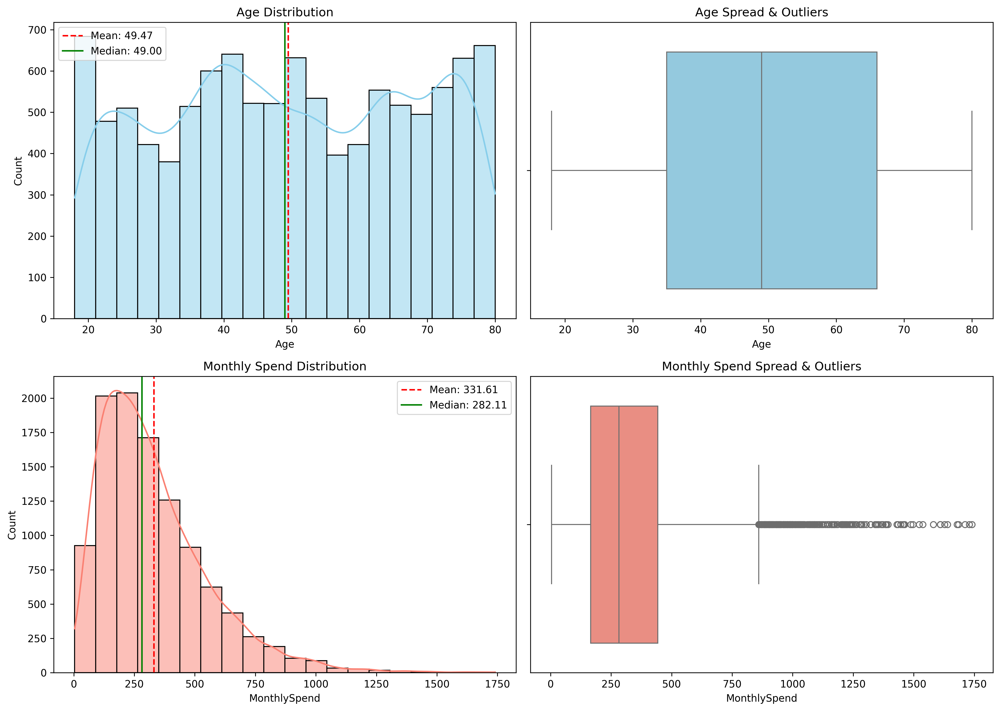
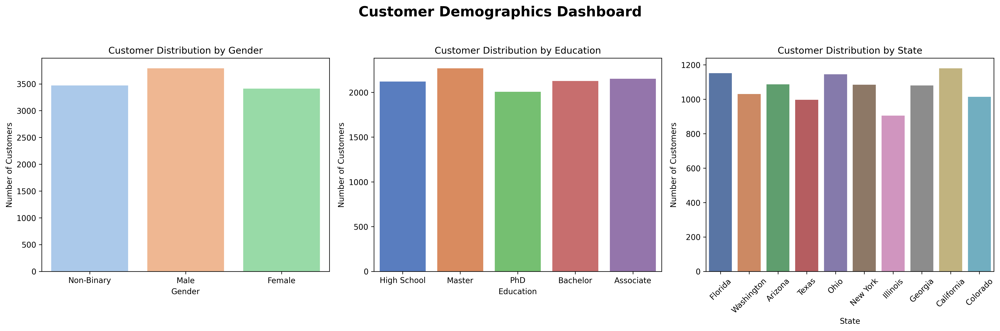
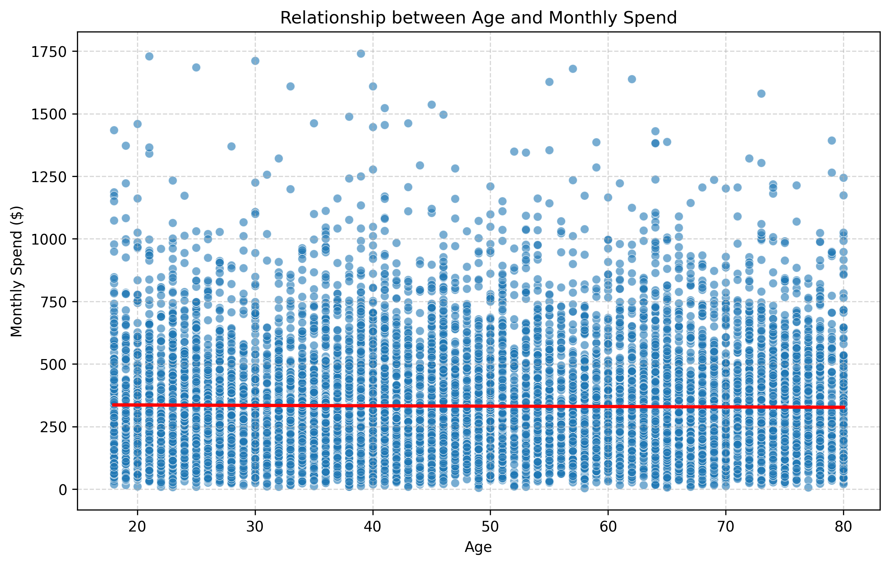
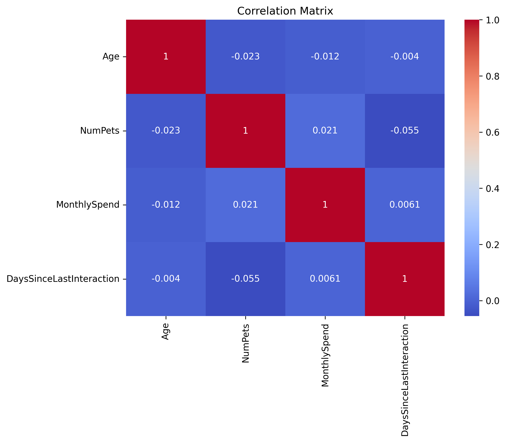
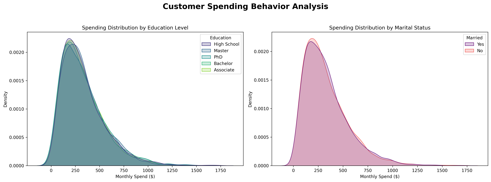
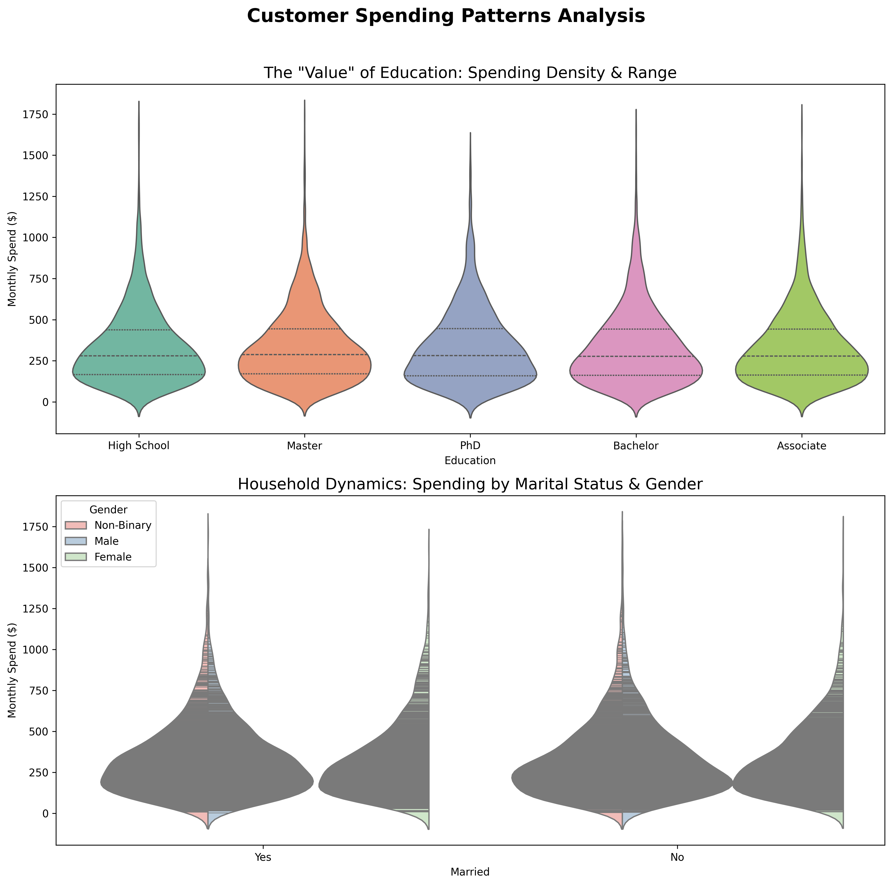

# Customer Insights Statistical Analysis

## Project Overview

This project applies descriptive statistics, exploratory data analysis (EDA), visualization, and hypothesis testing to uncover patterns in customer behavior and spending.

The analysis helps businesses understand customer demographics, spending habits, engagement levels, and statistically validate business assumptions.

---

## Business Problem

A retail company wants to understand:

- Customer spending behavior
- Demographic trends
- Customer activity levels
- Factors influencing revenue
- Whether observed differences are statistically significant

---

## Tools & Libraries

- Python
- Pandas
- NumPy
- Matplotlib
- Seaborn
- SciPy
- Jupyter Notebook

---

## Analysis Performed

### Descriptive Statistics
- Mean
- Median
- Standard Deviation
- Distribution Analysis

### Exploratory Data Analysis
- Histograms
- Boxplots
- Scatterplots
- KDE Plots

### Hypothesis Testing
- Gender vs Monthly Spending
- Education vs Monthly Spending
- Age vs Customer Activity
- State-wise Spending Analysis

---

## Key Insights

- Customer spending shows significant variability.
- High-value customer segments were identified.
- Several demographic factors influence spending behavior.
- Statistical testing was used to validate business assumptions.

---

## Business Recommendations

1. Target high-spending customer groups.
2. Improve engagement for inactive customers.
3. Personalize campaigns based on demographic insights.
4. Use data-driven segmentation strategies.

---

## Project Visualizations

### Customer Insights Dashboard

### Customer Demographics Dashboard

### Age vs Monthly Spend Analysis

### Correlation Matrix Heatmap

### Customer Spending Behavior Dashboard

### Customer Spending Patterns Dashboard

